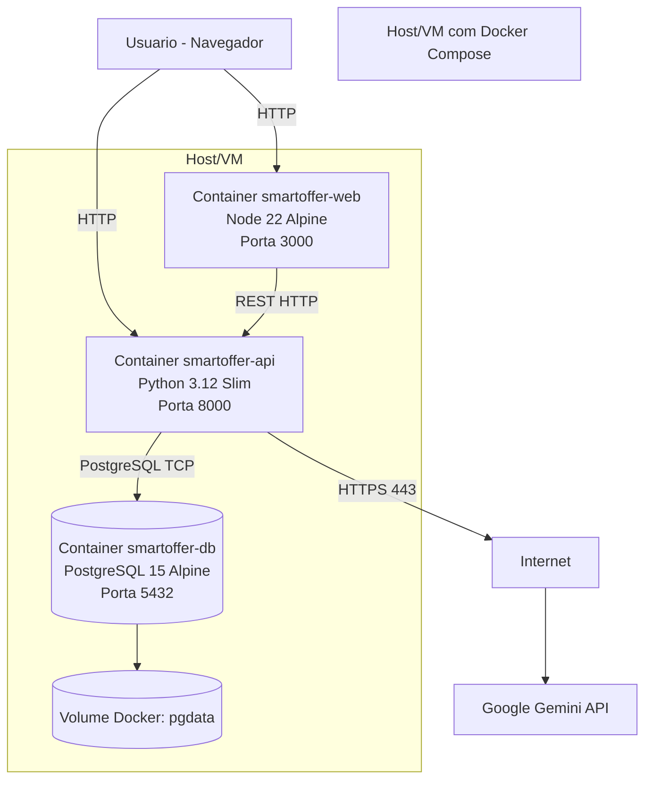
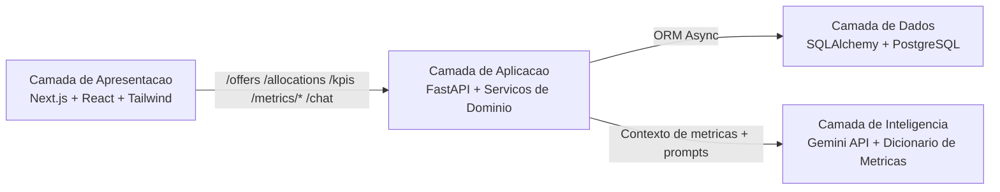

# Arquitetura da Solucao Smart Offer

> Documento arquitetural de referencia para entendimento da solucao ponta a ponta, conexoes de rede, tecnologias/versoes e diretrizes de melhoria continua.

## 1. Objetivo

Este documento consolida:

1. Arquitetura fisica (infraestrutura e onde cada componente roda)
2. Arquitetura logica (camadas, responsabilidades e fluxo de dados)
3. Conexoes de rede internas e externas (protocolos, portas, exposicao)
4. Catalogo de tecnologias e versoes atualmente em uso
5. Diretrizes de melhoria continua para evolucao segura da plataforma

## 2. Escopo da Solucao

A solucao Smart Offer e um sistema de gestao comercial para:

1. Ingestao de CSV de oportunidades
2. Calculo de alocacao e risco operacional
3. Exposicao de KPIs e simulacao de cenarios
4. Apoio por IA para interpretacao de metricas

## 3. Arquitetura Fisica (Deployment)

### 3.1 Topologia fisica atual

### 3.2 Mapeamento fisico de portas

| Porta host | Container alvo | Funcao |
|---|---|---|
| `3000` | `smartoffer-web` | Interface web (Next.js) |
| `8000` | `smartoffer-api` | API FastAPI e `/docs` |
| `5432` | `smartoffer-db` | Banco PostgreSQL |

## 4. Arquitetura Logica (Camadas)

### 4.1 Responsabilidades por camada

1. Apresentacao:
   Dashboard executivo, simulador, painois de risco, filtros, tema.
2. Aplicacao:
   Endpoints REST, RBAC, ingestao CSV, calculo de alocacao e KPIs.
3. Dados:
   Persistencia de ofertas, participantes e alocacoes diarias.
4. Inteligencia:
   Dicionario de metricas + explicabilidade + chat assistido por Gemini.

## 5. Conexoes de Rede (Fisico + Logico)

### 5.1 Conexoes internas

| Origem | Destino | Nivel | Protocolo/porta | Como conecta |
|---|---|---|---|---|
| Navegador do usuario | `smartoffer-web` | Fisico/externo | HTTP `:3000` | Porta publicada no host |
| Navegador do usuario | `smartoffer-api` | Fisico/externo | HTTP `:8000` | Porta publicada no host |
| Frontend (cliente) | API | Logico | REST HTTP `:8000` | `NEXT_PUBLIC_API_URL` |
| `smartoffer-api` | `smartoffer-db` | Logico interno | TCP `:5432` | DNS de servico Docker (`db`) |

### 5.2 Conexoes externas

| Origem | Destino | Protocolo/porta | Finalidade |
|---|---|---|---|
| `smartoffer-api` | `generativelanguage.googleapis.com` | HTTPS `443` | Chat e respostas de IA |

### 5.3 Consideracoes de segmentacao

1. Em producao, recomendar terminacao TLS em reverse proxy (Nginx/Traefik/ALB).
2. Restringir acesso externo direto a `5432`.
3. Aplicar politica de egress restrita para trafego externo (somente endpoints necessarios).

## 6. Fluxos Principais da Solucao

### 6.1 Ingestao de CSV

1. Usuario envia CSV via UI (`/upload`).
2. API faz parse/normalizacao.
3. API persiste ofertas e participantes.
4. API recalcula alocacoes diarias.
5. UI atualiza paineis com novos dados (`/offers`, `/allocations`, `/kpis`).

### 6.2 Consumo analitico

1. UI consome KPIs e datasets agregados.
2. Simulador utiliza estado local tipado para comparar baseline vs cenario.
3. Painel de risco usa alocacao e caracteristicas de oferta.

### 6.3 IA e explicabilidade

1. `/metrics/dictionary` entrega definicoes de metricas.
2. `/metrics/explainability` traz rastreabilidade KPI -> registros de origem.
3. `/chat` usa contexto de metricas e integra com Gemini quando chave esta configurada.

## 7. Tecnologias e Versoes

### 7.1 Runtime e infraestrutura

| Componente | Tecnologia | Versao | Fonte |
|---|---|---|---|
| Frontend container | Node.js Alpine | `22-alpine` | `infra/Dockerfile.web` |
| Backend container | Python Slim | `3.12-slim` | `infra/Dockerfile.api` |
| Banco de dados | PostgreSQL Alpine | `15-alpine` | `infra/docker-compose.yml` |
| Orquestracao local | Docker Compose | v2 (via CLI) | `infra/docker-compose.yml` |

### 7.2 Frontend (apps/web)

| Categoria | Tecnologia | Versao |
|---|---|---|
| Framework | Next.js | `^15.5.12` |
| UI | React | `^19.2.1` |
| UI DOM | react-dom | `^19.2.1` |
| Estado | Zustand | `^5.0.11` |
| Graficos | Recharts | `^3.7.0` |
| Visualizacao | D3 | `^7.9.0` |
| Animacao | Motion | `^12.23.24` |
| Icones | Lucide React | `^0.553.0` |
| Estilizacao | Tailwind CSS | `^4.1.11` |
| Qualidade | ESLint | `^9.39.1` |
| Testes unitarios | Vitest | `^4.0.18` |

### 7.3 Backend (apps/api)

| Categoria | Tecnologia | Versao (minima declarada) |
|---|---|---|
| API | FastAPI | `>=0.115.0` |
| ASGI | Uvicorn | `>=0.34.0` |
| ORM | SQLAlchemy asyncio | `>=2.0.36` |
| Driver DB | asyncpg | `>=0.30.0` |
| Migracoes | Alembic | `>=1.14.0` |
| Validacao | Pydantic | `>=2.10.0` |
| Settings | pydantic-settings | `>=2.7.0` |
| HTTP cliente | httpx | `>=0.28.0` |
| Seguranca auth | python-jose | `>=3.3.0` |
| Hash senha | passlib[bcrypt] | `>=1.7.4` |
| Testes | pytest | `>=8.3.0` |
| Cobertura | pytest-cov | `>=6.0.0` |
| SAST | bandit | `>=1.8.0` |

### 7.4 Monorepo packages internos

| Pacote | Versao | Papel |
|---|---|---|
| `@smart-offer/contracts` | `0.1.0` | Tipos compartilhados |
| `@smart-offer/ui` | `0.1.0` | Base UI/theme compartilhada |

## 8. Niveis de Conectividade (Fisico x Logico)

### 8.1 Nivel fisico

1. Host/VM publica portas para acesso local/rede.
2. Containers compartilham bridge network Docker.
3. Dados persistem em volume Docker (`pgdata`).

### 8.2 Nivel logico

1. UI conversa com API via REST.
2. API aplica regras de negocio e RBAC.
3. API conversa com DB de forma assicrona.
4. API integra opcionalmente com Gemini para IA.

## 9. Melhoria Continua (Arquitetura Evolutiva)

### 9.1 Praticas recomendadas

1. Revisao arquitetural mensal (ADRs + debt register).
2. Revisao de superficie de rede a cada release (portas, egress, CORS, TLS).
3. Gate de qualidade mandatorio em CI:
   frontend lint/build/coverage
   backend pytest/coverage
   SAST (Bandit + npm audit)
4. Observabilidade:
   padronizar metricas de latencia, erro e throughput por endpoint.
5. Resiliencia:
   health/readiness separados e politica de retry/circuit breaker para integracoes externas.

### 9.2 KPIs de evolucao arquitetural

1. Cobertura de testes >= 85% (frontend e backend)
2. Vulnerabilidades criticas = 0
3. Tempo medio de deploy e rollback
4. Tempo de resposta p95 por endpoint critico
5. Taxa de falhas de ingestao CSV

### 9.3 Backlog tecnico sugerido

1. Introduzir reverse proxy com TLS e politicas de seguranca HTTP.
2. Isolar banco para rede privada sem exposicao publica.
3. Adicionar tracing distribuido (OpenTelemetry).
4. Evoluir para rate limiting e quotas por rota sensivel.
5. Padronizar versionamento de API (ex.: `/api/v1`) quando necessario.

## 10. Referencias

1. `docs/day2/architecture.md`
2. `docs/day2/connectivity-matrix.md`
3. `docs/day2/component-registry.md`
4. `docs/day2/deployment-runbook.md`
5. `docs/adr/`
